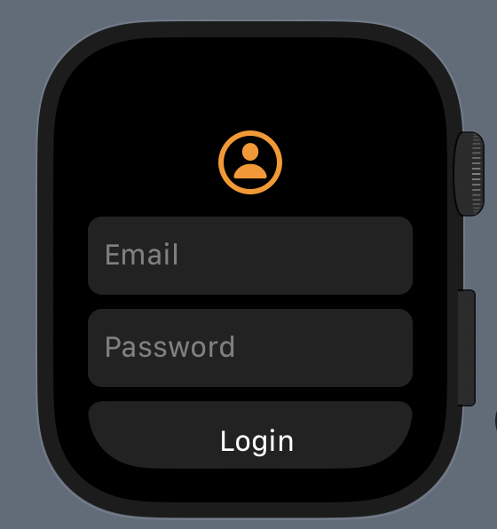
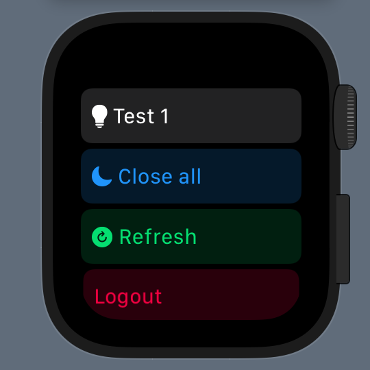
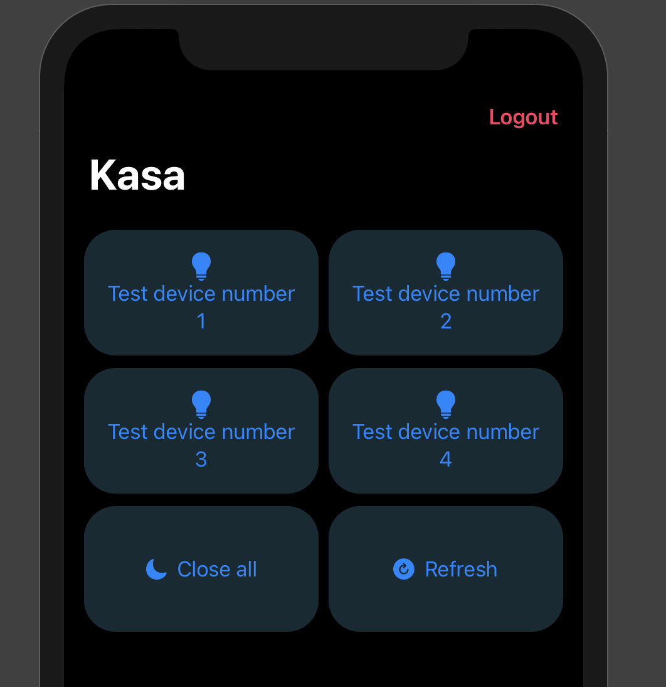
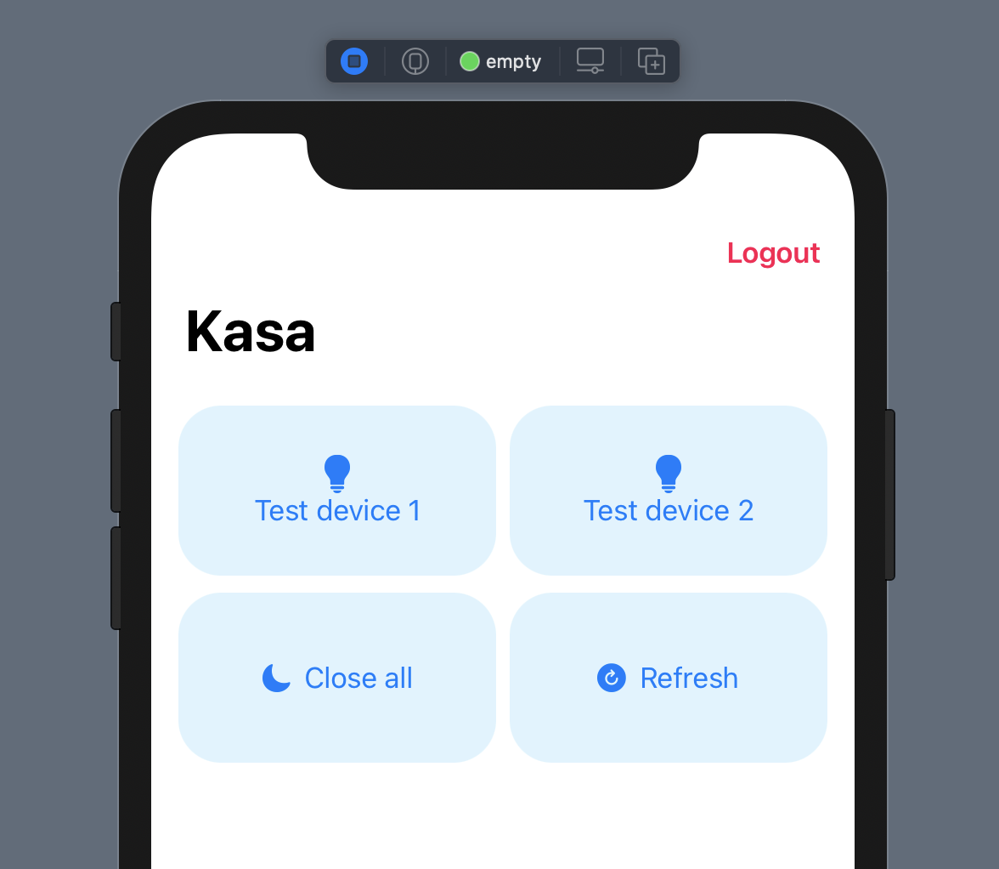
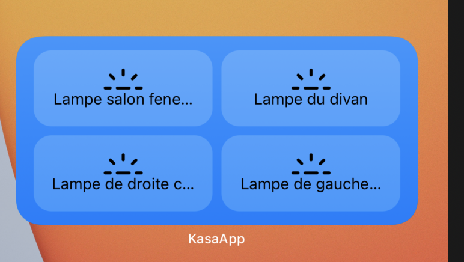
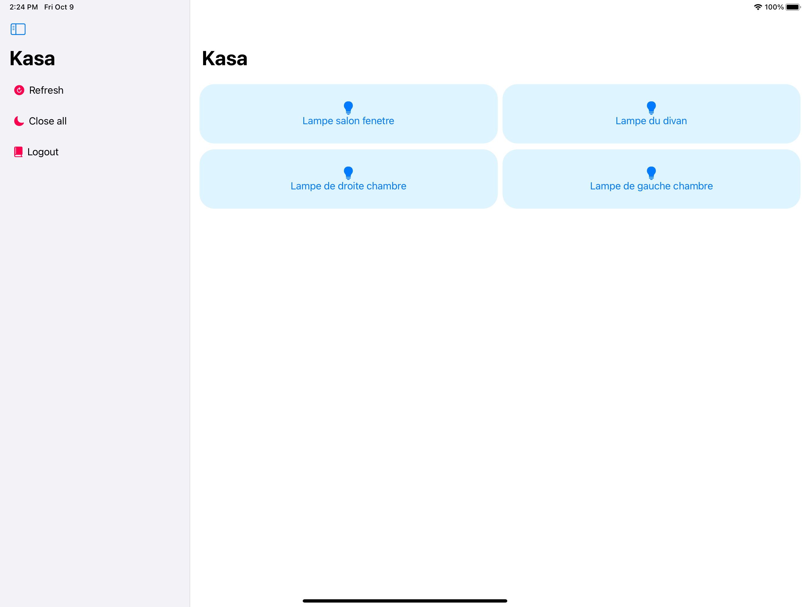
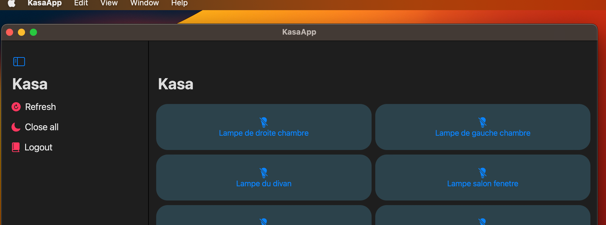

# Kasa WatchOS App

[](https://swift.org/download/)
[](https://swift.org/package-manager/) 

A simple WatchOS, iOS, iPadOS App to control Kasa devices.

To build the iOS and watchOS apps in the terminal, run the following.

```
make test-all-clean
```








